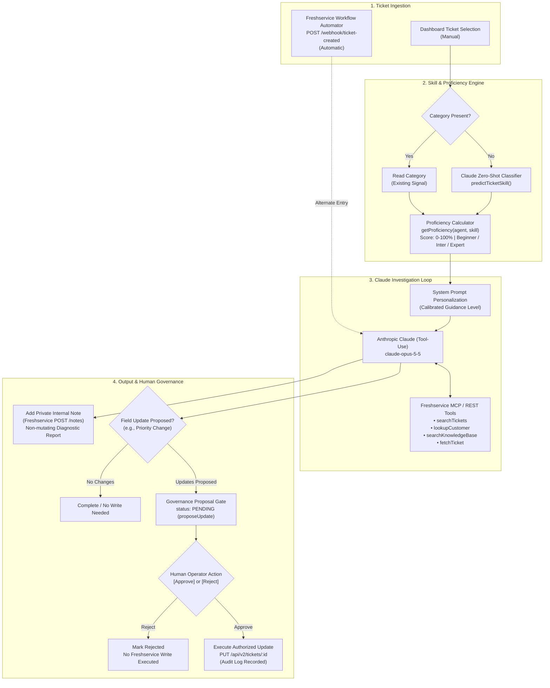

# SkillMesh

## Title
SkillMesh — Dynamic, Skill-Aware AI Agent Layer for Freshservice

## <1-line description>
An AI agent that investigates Freshservice tickets using live MCP data, personalizes its response based on the assigned agent's real proficiency for that ticket's required skill, and requires explicit human approval before making any real change.

## What it is
SkillMesh is not a conversational chatbot with a fixed set of hardcoded tools. It is an autonomous investigation agent that dynamically determines how much guidance and detail to provide based on (a) the technical skill required by a ticket and (b) the assigned human agent's track record and verified proficiency in that specific skill domain. Instead of outputting generic responses to junior and senior agents alike, SkillMesh calibrates its reasoning and recommendations to the user's expertise level. The system interfaces directly with a live Freshservice instance via the Model Context Protocol (MCP) and REST API, operating on real tickets, requester details, and ticket histories rather than mock or simulated environments.

## What it does (business objective)
- **Reads or predicts ticket skill requirements:** Identifies the primary domain required by an incoming ticket from its existing Freshservice category, or falls back to a Claude zero-shot classifier (`predictTicketSkill`) to classify the subject and description into Software, Network, Hardware, or Access when the category is unset.
- **Computes skill-specific agent proficiency:** Evaluates the assigned agent's historical resolution-to-escalation track record specifically for the required skill (producing an empirical score 0–100% and a tier: Beginner, Intermediate, or Expert), avoiding coarse, one-size-fits-all job titles or seniority labels.
- **Runs a live Claude tool-calling investigation loop:** Orchestrates multi-turn tool calling with Anthropic Claude (`claude-opus-5-5`), querying Freshservice via MCP tools (`searchTickets`, `lookupCustomer`, `searchKnowledgeBase`, `fetchTicket`) to determine root causes and analyze past incidents.
- **Adapts guidance depth to proficiency:** Adjusts the prompt instruction and output depth dynamically: providing step-by-step diagnostic checklists and runbooks for Beginner agents, focused action items for Intermediate agents, and concise, direct recommendations for Expert agents.
- **Enforces strict human-in-the-loop governance:** When Claude suggests ticket field modifications (such as priority escalation), it invokes `updateTicket`, which records a pending proposal (`proposeUpdate`) rather than mutating Freshservice directly. Every state modification remains blocked until explicitly reviewed and confirmed (`POST /approve/:actionId`) or rejected (`POST /reject/:actionId`) by a human operator, backed by an immutable governance audit trail.
- **Posts diagnostic investigation notes to Freshservice:** Automatically appends Claude's technical diagnosis, agent proficiency context, and governance status as a private, internal note directly onto the Freshservice ticket (`createTicketNote` / `POST /api/v2/tickets/:id/notes`) without alerting requesters or altering ticket SLA fields.
- **Supports manual and automated triggering:** Investigations can be triggered on demand by agents through the web dashboard (`POST /api/investigate`), or received automatically from Freshservice Workflow Automator webhooks (`POST /webhook/ticket-created`) upon ticket creation.
- **Surfaces skill gaps for administrator review:** Identifies recurring ticket topics that lack assigned skill tags or operational runbooks, surfacing them in the dashboard as recommendations for IT managers to formalize into new categories.

## What it doesn't do (out of scope)
- **Enterprise-scale historical profiling:** Proficiency metrics are currently derived from a predefined test matrix (`DEMO_PROFICIENCY_DATA` in `brain/proficiency.js` for demo personas like Priya Sharma and Rahul Mehta), rather than aggregated from months of historical ticket logs across an entire organization.
- **Autonomous taxonomy creation:** The agent does not automatically create new category or tag entities inside Freshservice; it surfaces untagged cluster patterns in the dashboard for human admins to review and approve.
- **In-product sidebar (Freshworks FDK app):** SkillMesh currently runs as an external web dashboard and Node.js backend connected via ngrok and webhooks, not as an embedded iframe inside the Freshservice ticket details page.
- **Multilingual and voice modalities:** The agent operates exclusively via text in English; it does not support multi-language translation, speech-to-text, or text-to-speech.
- **Third-party integrations beyond Freshworks and Anthropic:** No integrations exist with Sarvam, Vobiz, Databricks, or ElevenLabs.

## Product Integrations
- **Freshworks (Freshservice)** — Model Context Protocol (MCP) connection (`https://<domain>/mcp`) and REST API (`/api/v2`) for live ticket retrieval (`fetchTicket`, `fetchTickets`), requester context lookup (`lookupCustomer`), solution folder inspection (`searchKnowledgeBase`), ticket field execution (`updateTicket`), and private internal note creation (`createTicketNote`); Freshservice Workflow Automator webhook endpoint (`POST /webhook/ticket-created`) for event ingestion.
- **Anthropic (Claude)** — Powers the core agent reasoning engine (`claude-opus-5-5` Messages API) using tool-calling specifications to plan data retrieval, classify ticket domains, synthesize technical findings, and formulate governance-compliant update proposals.

## System Interaction Diagram

